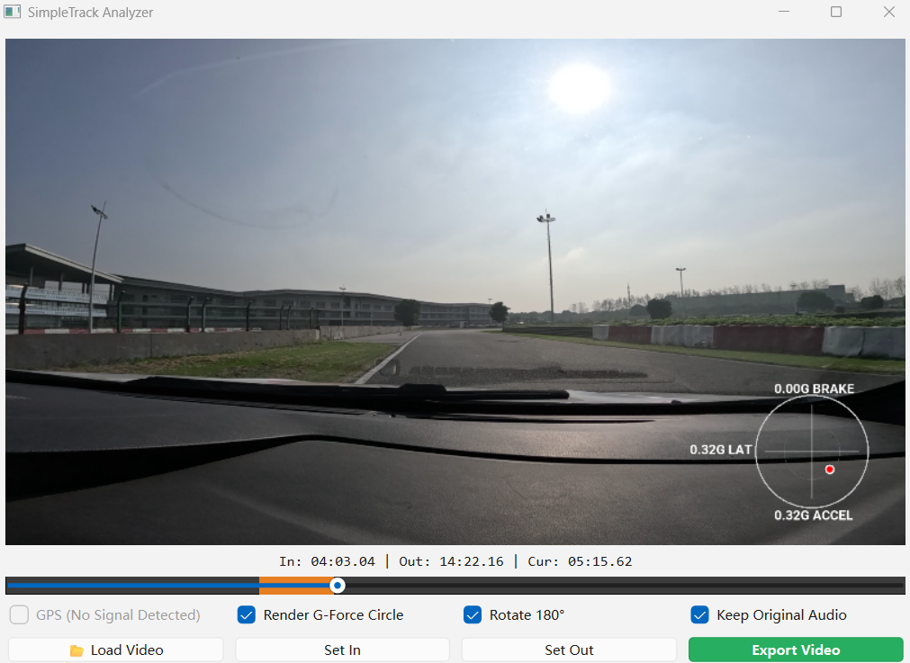

# SimpleTrack-Analyzer
Gopro track data overlay



## Key Features:


## Precision G-Force Visualization:

Friction Circle Analysis: A smooth, anti-aliased G-force meter designed to help drivers visualize Trail Braking and tire grip limits.

Dynamic Motion Trails: Tracks the history of your G-loads to identify "cross-shaped" inputs vs. professional "arc-shaped" transitions.

## Driver-Centric Logic:

Rolling Mean Smoothing: Filtered IMU data to eliminate GoPro sensor noise while preserving transient response.


Inversion Support: One-click 180° rotation for inverted cockpit camera mounts.

Create conda：

```bash

# Create a new conda environment
conda create -n track_analysis_env python=3.10 -y 

# Activate the environment
conda activate track_analysis_env

# Install dependencies (Note: numpy < 2 is required for compatibility)
pip install "numpy<2" pandas opencv-python telemetry-parser matplotlib PyQt6 Pillow

```

run:

```bash
python gopro_overlay.py

```

## 📖 Background

Since **GoPro Quik for Desktop** is no longer being updated for professional telemetry overlays, many users (including myself) found it difficult to find a lightweight, high-performance tool to visualize track data. 

I created **SimpleTrack-Analyzer** to solve this—providing a simple, efficient way to overlay G-Force and IMU data.


Step 1	环境搭建	使用 Carla 或 Assetto Corsa 仿真器获取视觉数据。
Step 2	赛道分割	部署 RaceGAN 或 YOLOv11-seg 识别赛道边界。
Step 3	地图建模	将分割结果通过 IPM 转换为 XY 坐标系下的赛道宽度和曲率。
Step 4	路径优化	调用 TUM CommonRoad 库生成最佳行车线。
Step 5	闭环测试	编写 MPC 控制器，在仿真中验证赛车是否能跑出最快圈速。

截图天马山：从 Google Earth 截取一张高清的天马赛道图。

像素缩放：计算出图片中 1 像素代表多少米（比例尺校准）。

实时投影：在你现在的代码中增加一个子窗口，显示卫星地图。将你 IMU 推算出的车辆坐标点实时画在卫星图上。

手动/自动校准：当你发现点跑偏了，利用 SegFormer 识别出的弯道顶点（Apex）作为参照，强制重置 IMU 的坐标。


